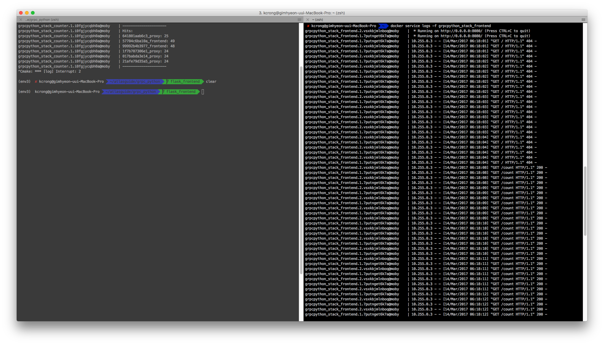

# GRPC python 


## Using Virtualenv
> After Install python >= 3.6

```bash
python3 -m pip install virtualenv
python3 -m virtualenv env3
source env3/bin/activate
pip install -r requirements/requirements.txt
```


## Turn on DNS Server
```bash
(env3) bash $ python dns/server.py
```

## Turn on Counter Server
```bash
(env3) bash $ python counter/server.py
```

## Turn on Frontend
```bash
(env3) bash $ python web.py frontend 0.0.0.0 [ANY EMPTY PORT]
```

## Turn on PROXY
```bash
(env3) bash $ python web.py proxy 0.0.0.0 [ANY EMPTY PORT]
```

## Result




## But..
there is some docker-sompose issue that related with ip address
- https://github.com/docker/compose/issues/4471
- http://stackoverflow.com/questions/35459262/how-to-set-static-ip-address-to-a-container-running-into-a-swarm-over-a-weave-ov
